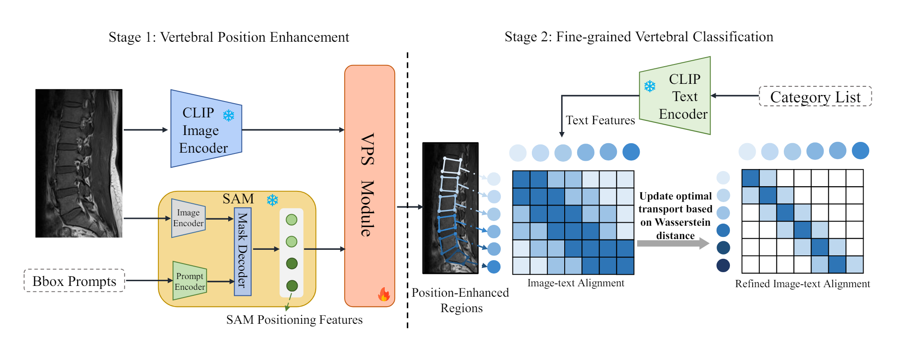

# VertFound: Synergizing Semantic and Spatial Understanding for Fine-grained Vertebrae Classification via Foundation Models



## News

- `2024/05/15` Code release! You can reproduce our work through this repo.

## QuickStart

### Installation

- Firstly, launch a new environment and install pytorch for this repo:

```shell
conda create -n vertfound python=3.9
conda activate vertfound

pip install torch==1.13.0+cu117 torchvision==0.14.0+cu117 -f https://download.pytorch.org/whl/torch_stable.html
```

- After that, install CLIP in the version of openai's official implementation:

```shell
pip install ftfy regex tqdm
pip install git+https://github.com/openai/CLIP.git
```

- Then you need to install detectron2 by following this [guide](https://github.com/facebookresearch/detectron2/blob/main/INSTALL.md#installation).

- Finally, install requirements:

```shell
git clone https://github.com/inhaowu/VertFound.git
cd VertFound
pip install -r requirements.txt
```

### Pretrained weights

- SAM Pretrain Weights (ViT-base)

```shell
mkdir -p sam_checkpoints
cd sam_checkpoints
wget https://dl.fbaipublicfiles.com/segment_anything/sam_vit_b_01ec64.pth
cd ..
```

- VertFound Pretrain Weights (Trained on Object365 and COCO): [vertfound-base](https://drive.google.com/file/d/1DSlBKfvn2hYoLdS97Fst1NJMfdNFz5SE/view?usp=drive_link) and [vertfound-large](https://drive.google.com/file/d/1BjHgXYZG_oLDefEOmbTJxkSHqmXIqkeO/view?usp=drive_link).

### Data preparation

Now **only avaliable** for 2D Verse dataset. For example, you can slice 10-15 sagittal images per patient from 3D data.

- Firstly, prepare your data in COCO format and place it under `datasets`.
- Then you need to generate sam embeddings of the dataset by runing:

```shell
python scripts/generate_embedding.py --train_file /path/to/your/file --test_file /path/to/your/file --image_path /path/to/your/data
```

### Training

```shell
# You can edit this in train.sh
python train_net.py --num-gpus 8 \
    --config-file configs/Base-VertFound.yaml \
    --dist-url auto \
    TEST.EVAL_PERIOD 100 \
    SOLVER.IMS_PER_BATCH 32 \
    SOLVER.MAX_ITER 10000 \
    MODEL.WEIGHTS weights/vertfound_bl.pth \
    MODEL.CLIP_TYPE CLIP_400M_Large \
    MODEL.CLIP_INPUT_SIZE 224 \
    MODEL.BOX_TYPE 'GT' \
    DATASETS.TRAIN '("your_dataset",)'\
    DATASETS.TEST '("your_dataset",)' \
    SOLVER.CHECKPOINT_PERIOD 100 \
    OUTPUT_DIR ./output/verse19_vertfound
```

### Evaluation

```shell
# You can edit this in test.sh
python train_net.py --num-gpus 8 \
    --config-file configs/eval.yaml \
    --eval-only True \
    --dist-url auto \
    MODEL.WEIGHTS /path/to/your/weight \
    MODEL.CLIP_TYPE CLIP_400M_Large \
    MODEL.CLIP_INPUT_SIZE 224 \
    MODEL.BOX_TYPE 'GT' \
    DATASETS.TRAIN '("your_dataset",)'\
    DATASETS.TEST '("your_dataset",)'\
    SOLVER.IMS_PER_BATCH 32
```

## Citing VertFound

Coming soon...